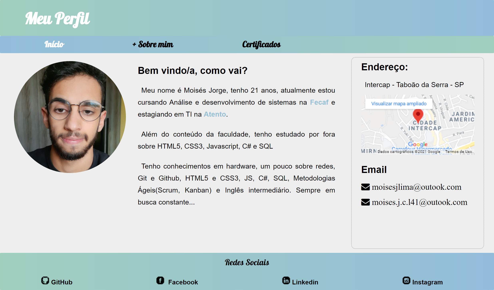

# Profile-Page
Atividade de Front End da faculdade na matéria Projeto Integrador Orientado, onde o objetivo foi desenvolver uma página de perfil contando um pouco sobre mim, utilizando somente HTML5 e CSS3 puro.

